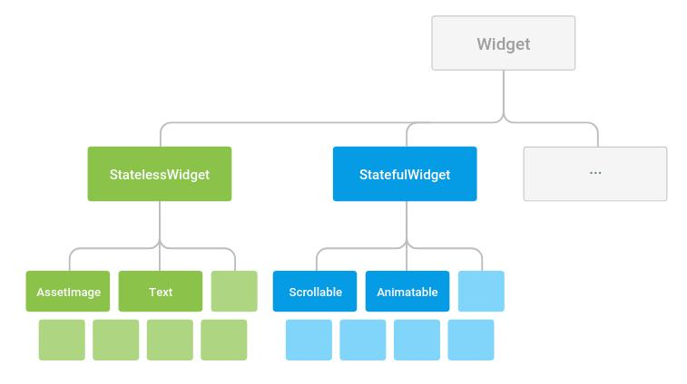
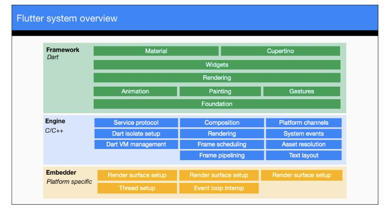
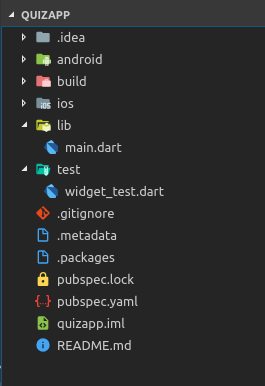

<div align="center">
  <h1>Flutter - Day 1</h1>
  <p>Flutter Installation, Flutter Codes Go through</p>
</div>


# What is Flutter

It is an SDK for building high-performance, high fiedlity apps for iOS, Android, Web(beta), Desktop(technical preview) from a single codebase

Apps are written using Dart language.Even a newbie can develop apps using Flutter. It is similar like Java and Javascript. Having an good understanding about OOPs concept will be good

# Why Flutter

* Highly productive (Will see at Day 30)
* Do more with less code, expressive language and declarative approach
* Create beautiful and highly customized user experience


# What is a widget

Widget is the basic building block of a Flutters user interface. Each widget is an immutable part of the user interface

A widget can define:

 * a strucural element(button or menu)
 * a stylistic element(like a font or color scheme)
 * an aspect of layout(like padding)

 Widgets form a hierarchy based on composition. Each widget nests inside, and inherits properties from, its parent. There is no separate “application” object. Instead, the root widget serves this role.

 <div align="center">
   
 </div>

# Flutter Overview

<div align="center">
   
 </div>

# Installation

Clone the flutter SDK from the below link

```
git clone https://github.com/flutter/flutter.git -b stable
```

Once cloned open the `.bashrc` file and add the below line 

```
//set Flutter
export FLUTTER_HOME=/home/nidhin/flutter
export PATH=$FLUTTER_HOME/bin:$PATH
```

Once it is done run the below command in your terminal

```
flutter doctor
```
There you can check whether everthing is installed properly


# Creating a new Flutter project

To create a new Flutter type the below command in your terminal

```
flutter create applicationname
```

Once the project is created navigate to the `applicationname` and run the project using the command `flutter run`

To see the list of devices attached you can type the command `flutter devices`


# Whats inside Flutter

This is how the Flutter structure would be

<div align="center">
   
 </div>


1. `.idea` directory will have the android studio stuffs we won't do anything here
2. `android` directory contains all the converted codes from flutter to java(Not exactly)
3. `ios` directory contains all the xcode files of the project which we have created
4.  In the above structure we will write all our logics inside the `lib` directory 
5. `test` directory contains the automated test files which we might do it later 
6. `pubspec.yaml` file is similar like `package.json` where will add the 3rd party dependencies, assets and fonts

