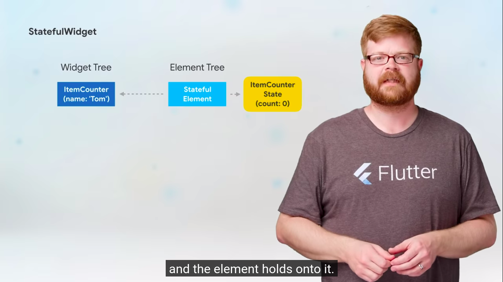

  <h1>Flutter - Day 11</h1>
  
UserInterface - Creating Stateful widgets

## How Stateful widgets are different from Stateless widgets
## How State objects works

# How Stateful widgets are different from Stateless widgets

Stateless widgets are immutable that is it cannot be changed for example once a button is created it cannot be changed.

Suppose if you are having an button and if each time the button is clicked if u want to increment an value it cannot be done with stateless widgets because it is immutable(cannot be changed).

But if you want to handle it. You should use the stateful widget which is mutable(value can be changed). which would reflect in the UI

If u see the stateful widgets there are two things

1. Widgets
2. State objects

#### Widgets

* The widgets are responsible for immutable things (variables which has been declared `final` should be kept as it is.)
* Creating the state object

#### State Object

The state object on the other side holds the count value which is not tagged as final

Widget Tree for stateless widget

   
 

 Widget Tree for stateful widget

 

   
 

   
 

   
 

 

   
 

 

   
 

In the stateful widget first the `Stateful Element` will call the Widget Tree for the widgets which in returns Widget and `State`. So whenever the state is updated it will create an Stateless Element which would render the UI.

Now the state object marks it's element as dirty. as well as whenever the other widget is changed the state object remains as it is. as well as the stateful Element remains the same since the widget is of same type for example (Name property) and only the value is getting changed. It is similar like setState in react

#### Inherited Widgets

Suppose if u have 100 of stateful widget and if u want to pass data from 1 to 76th widget means it can be done using `Inherited Widgets` which is similar like inheritance that is inheriting the properties from the parent to child

You might notice the inherited widgets in the coding for themes like `Theme.of(context)` where we would take the color from a global declaration.

#### Keys

There is one more `Keys` which is used to store the values for example if u have two stateful widgets which displays colors and if u swap the containers it should change for that purpose we would use `keys`. Typically whats happens is in the element tree it will check each key in the element tree and widget tree if both are same it will leave it. If anything gets changes then it will update the UI.

To know more about keys and inherited Widgets click the below links

* Inherited Widgets - [Click here to view](https://www.youtube.com/watch?v=Zbm3hjPjQMk&list=PL-B0-NEYQT8dMVGTVYKv0sv_NOg--wtx1&index=4)
* Keys - [Click here to view](https://www.youtube.com/watch?v=kn0EOS-ZiIc&list=PL-B0-NEYQT8dMVGTVYKv0sv_NOg--wtx1&index=5)