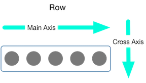
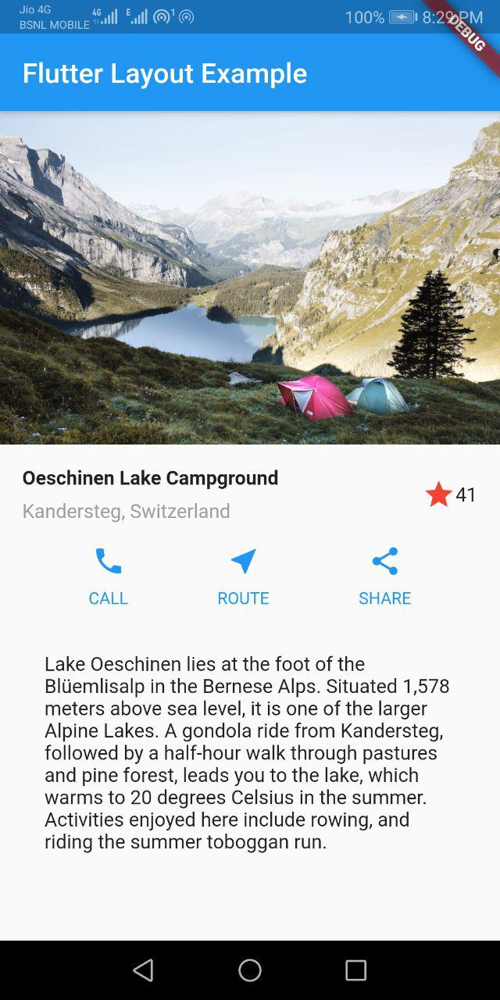
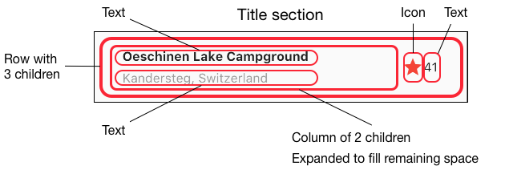
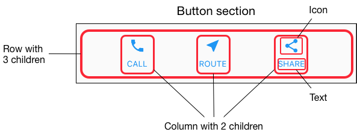

<div align="center">
  <h1>Flutter - Day 12</h1>
  <p>UserInterface - Layouts</p>
</div>

# Points

1. `Rows` and `Columns` are the two commonly used layouts
2. `Row` and `Column` each take a list of child widgets
3. We can specify how a Row or Column aligns its children, both vertically and horizontally
4. We can stretch or constrain specific child widgets.
5. We can specify how child widgets use the Rows or Columns available space

# Alignment

<div align="center">
   
 </div>

* MainAxisAlignment
* CrossAxisAlignment

# Sizing widgets

When a layout is too large to fit a device, a yellow and black striped pattern appears along the affected edge.

<div align="center">
   
</div>

# Standard widgets

* Container: Adds padding, margins, borders, background color, or other decorations to a widget.
* GridView: Lays widgets out as a scrollable grid.
* ListView: Lays widgets out as a scrollable list.
* Stack: Overlaps a widget on top of another.

# Material widgets

* Card: Organizes related info into a box with rounded corners and a drop shadow.
* ListTile: Organizes up to 3 lines of text, and optional leading and trailing icons, into a row.


## Example

We will create a simple layout like the below image

<div align="center">
   
</div>

Before writing the code first diagram the layout

1. Identify the rows and columns.
2. Does the layout include a grid?
3. Are there overlapping elements?
4. Does the UI need tabs?
5. Notice areas that require alignment, padding, or borders.

Once it is done create the layout

<div align="center">
   
</div>


<div align="center">
   
</div>

## Code

```
import 'package:flutter/material.dart';
import 'package:layout_example/components/text.dart';
import 'package:layout_example/components/title.dart';

void main() => runApp(MyApp());

class MyApp extends StatelessWidget {
  @override
  Widget build(BuildContext context) {
    Color color = Theme.of(context).primaryColor;

    Widget buttonSection = Container(
      child: Row(
        mainAxisAlignment: MainAxisAlignment.spaceEvenly,
        children: [
          _buildButtonColumn(color, Icons.call, 'CALL'),
          _buildButtonColumn(color, Icons.near_me, 'ROUTE'),
          _buildButtonColumn(color, Icons.share, 'SHARE'),
        ],
      ),
    );

    return MaterialApp(
      title: 'Flutter Layout Example',
      home: Scaffold(
          appBar: AppBar(
            title: Text('Flutter Layout Example'),
          ),
          body: ListView(
            children: [
              Image.asset(
                'assets/images/lake.jpg',
                height: 240,
                width: 600,
                fit: BoxFit.cover,
                ),
              titleSection, 
              buttonSection, 
              textSection
            ],
          )),
    );
  }

  Column _buildButtonColumn(Color color, IconData icon, String label) {
    return Column(
      mainAxisSize: MainAxisSize.min,
      mainAxisAlignment: MainAxisAlignment.center,
      children: [
        Icon(icon, color: color),
        Container(
          margin: const EdgeInsets.only(top: 8),
          child: Text(
            label,
            style: TextStyle(
                fontSize: 12, fontWeight: FontWeight.w400, color: color),
          ),
        ),
      ],
    );
  }
}

```

## Title Section

```
import 'package:flutter/material.dart';

Widget titleSection = Container(
  padding: EdgeInsets.all(32),
  child: Row(
    children: [
      Expanded(
        child: Column(
          crossAxisAlignment: CrossAxisAlignment.start,
          children: [
            Container(
                padding: EdgeInsets.only(bottom: 8),
                child: Text(
                  'Oeschinen Lake Campground',
                  style: TextStyle(fontWeight: FontWeight.bold),
                )),
            Text('Kandersteg, Switzerland',
                style: TextStyle(color: Colors.grey[500])),
          ],
        ),
      ),
      Icon(
        Icons.star,
        color: Colors.red[500],
      ),
      Text('41'),
    ],
  ),
);

```

## Text Section

```
import 'package:flutter/material.dart';

Widget textSection = Container(
  padding: EdgeInsets.all(32),
  child: Text(
    'Lake Oeschinen lies at the foot of the Blüemlisalp in the Bernese '
    'Alps. Situated 1,578 meters above sea level, it is one of the '
    'larger Alpine Lakes. A gondola ride from Kandersteg, followed by a '
    'half-hour walk through pastures and pine forest, leads you to the '
    'lake, which warms to 20 degrees Celsius in the summer. Activities '
    'enjoyed here include rowing, and riding the summer toboggan run.',
    softWrap: true,
  ),
);
```

## Button Section

```
Color color = Theme.of(context).primaryColor;

Widget buttonSection = Container(
    child: Row(
    mainAxisAlignment: MainAxisAlignment.spaceEvenly,
    children: [
        _buildButtonColumn(color, Icons.call, 'CALL'),
        _buildButtonColumn(color, Icons.near_me, 'ROUTE'),
        _buildButtonColumn(color, Icons.share, 'SHARE'),
    ],
    ),
);

Column _buildButtonColumn(Color color, IconData icon, String label) {
    return Column(
      mainAxisSize: MainAxisSize.min,
      mainAxisAlignment: MainAxisAlignment.center,
      children: [
        Icon(icon, color: color),
        Container(
          margin: const EdgeInsets.only(top: 8),
          child: Text(
            label,
            style: TextStyle(
                fontSize: 12, fontWeight: FontWeight.w400, color: color),
          ),
        ),
      ],
    );
}
```