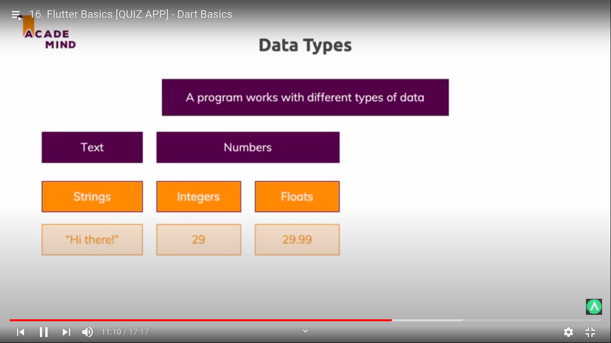

<div align="center">
  <h1>Flutter - Day 2</h1>
  <p>Dart Basics</p>
</div>

# Whenever a variable is created it is better to give types for the variables

```
double addNumbers(double num1, double num2) {
    return num1 + num2;
}

void main() {
  double result;
  result = addNumbers(1, 2.3);

  print(result);
}
```

It is better to give types

* If the function returns nothing means we can give void else the type can be given
* print is similar like console.log in javascript
* main function is needed and we can create multiple functions from it
* variables, function naming should be camelcase

# We can create an object / class like below

```
class Person {
  String name = 'Nidhin';
  int age = 27;
}

void main() {
    var p1 = Person();
    print(p1.name); //print Nidhin
    var p2 = Person();
    p2.name = 'Kumar';
    print(p2.name); //prints kumar
}
```


<div align="center">
   
 </div>