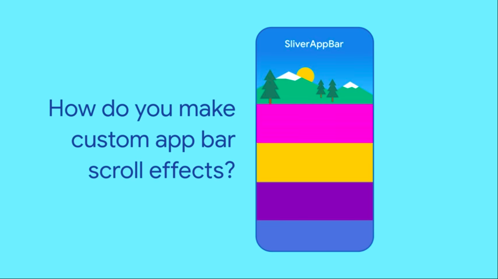
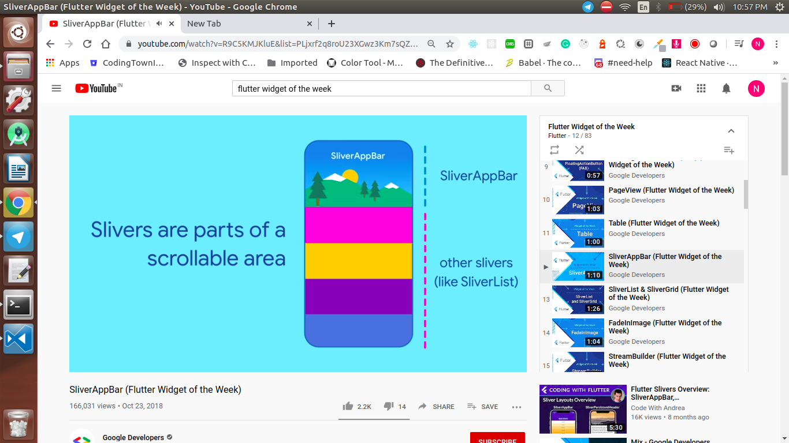
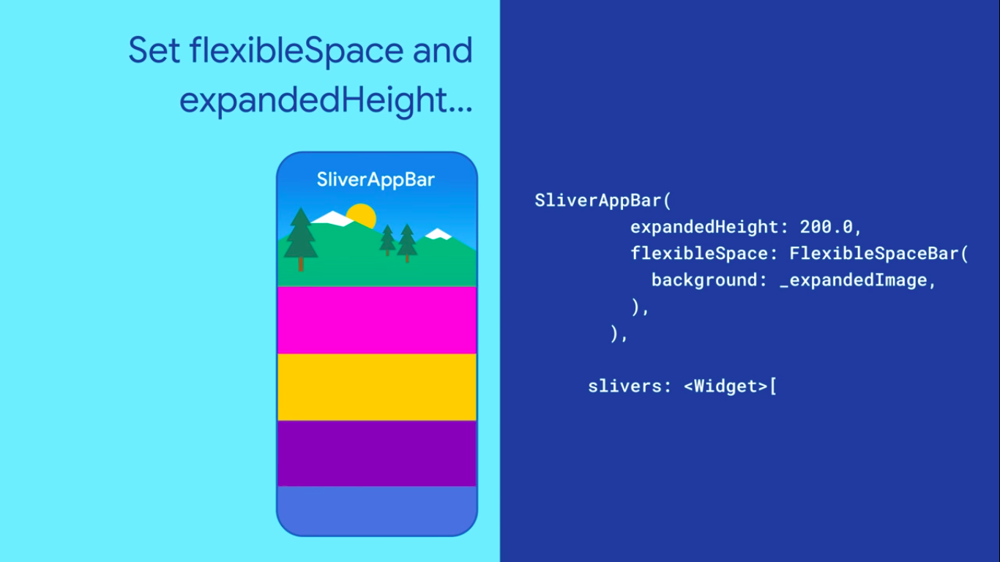

  <h1>Flutter - Day 21</h1>
  
Flutter Widgets - SilverAppBar

SilverAppBar is like when you scroll the list view you could see a image being dropped out similar like Android Custom AppBar

   
 

It can be achieved using SilverAppBar widget in flutter. SilverAppBar is used with `CustomScrollView` to provide custom scroll behaviour of the app bar

  

we can set the expandableHeight as well as flexibleSpace inside the silverAppBar like below

   
 

set the floating parameter to true to make the appbar reappear when it is scrolled down
