<div align="center">
  <h1>Flutter - Day 22</h1>
  <p>Flutter Widgets</p>
</div>

# SilverList and SilverGrid

If you want to have both list and grid view and want to scroll the both then we can use the SilverList and silverGrid.

Silvers are a part of scrollable area


<div align="center">
   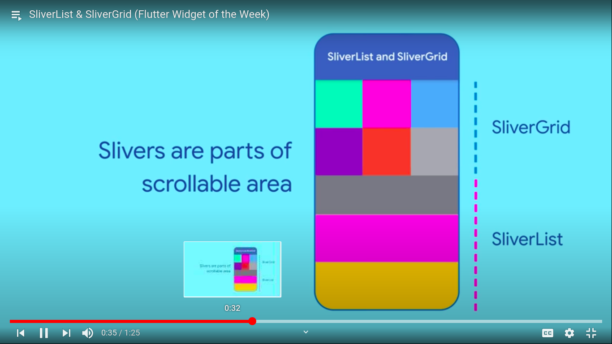
 </div>

 We will have an delegate option like below

 <div align="center">
   
 </div>

 # FadeinImage

 If you are loading an image from network it would be great if we show an image from our local assets folder and once the image from the network is downloaded we can show that image by fading the placeholder image

 It can be done using FadeinImage widget

 <div align="center">
   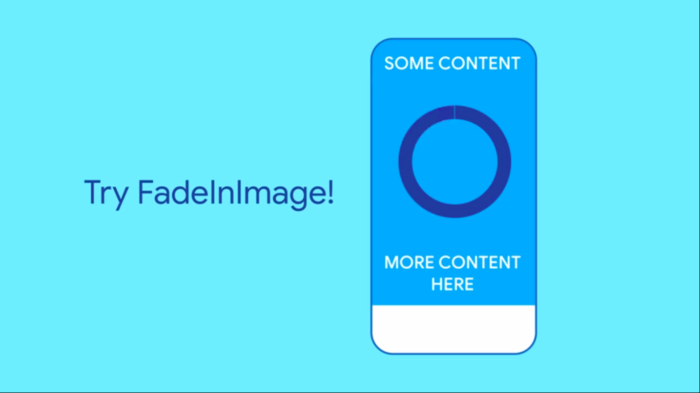
 </div>

 Use a placeholder from an assets directory

 <div align="center">
   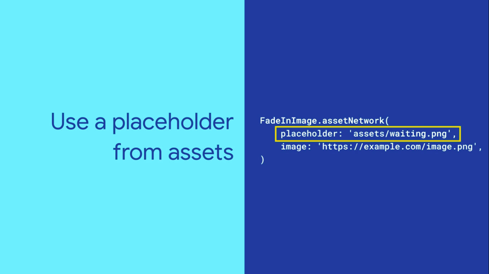
 </div>

 We can set the height or width to set dimensions

  <div align="center">
   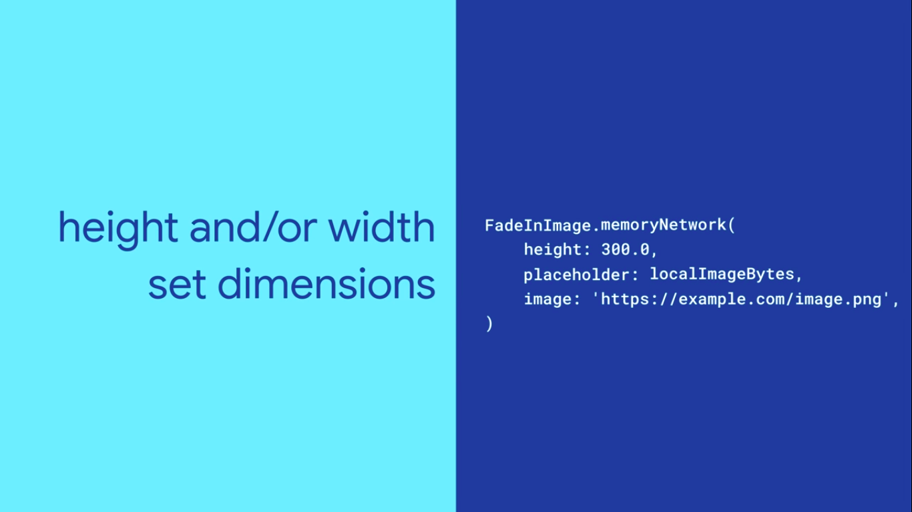
 </div>

 We can set the animation time using fadeinduration

  <div align="center">
   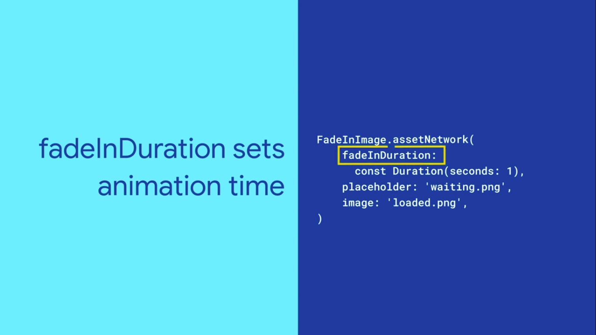
 </div>

 We can set the animation type using fadeInCurve

  <div align="center">
   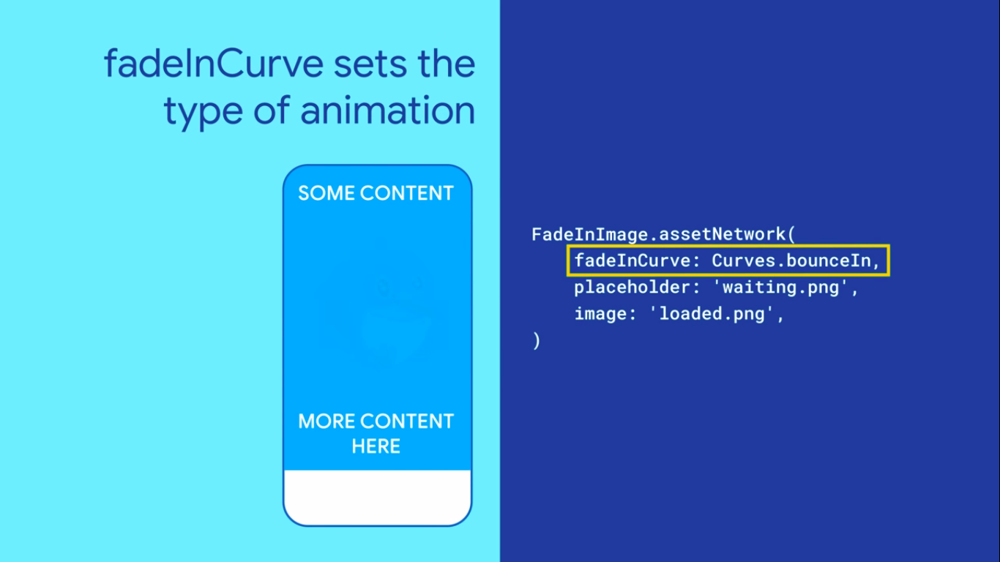
 </div>

 # StreamBuilder

 If we are having an aysnchronous connection or the data send or received is of asynchronous type then we will use streambuilder widget

 <div align="center">
   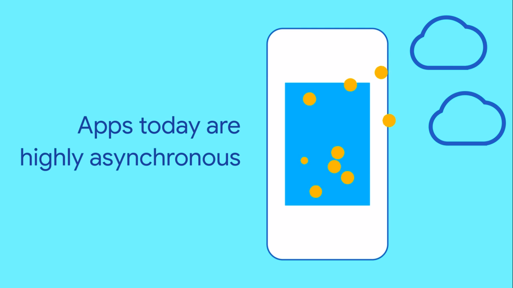
 </div>

 Dart handles the asynchronous data using Stream 

 <div align="center">
   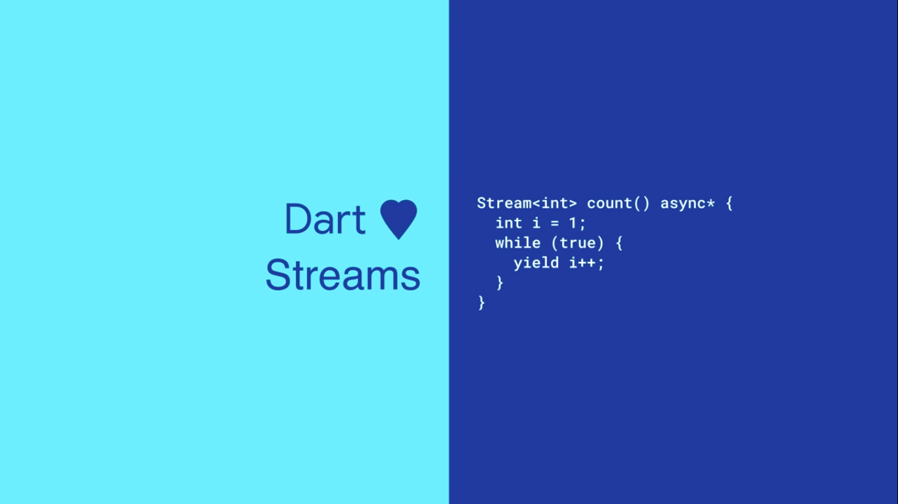
 </div>

 For flutter we will use StreamBuilder to handle the async data

 <div align="center">
   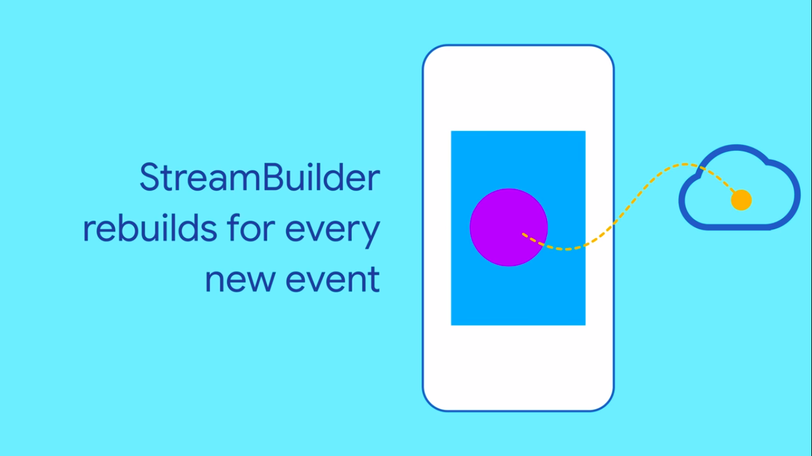
 </div>

 <div align="center">
   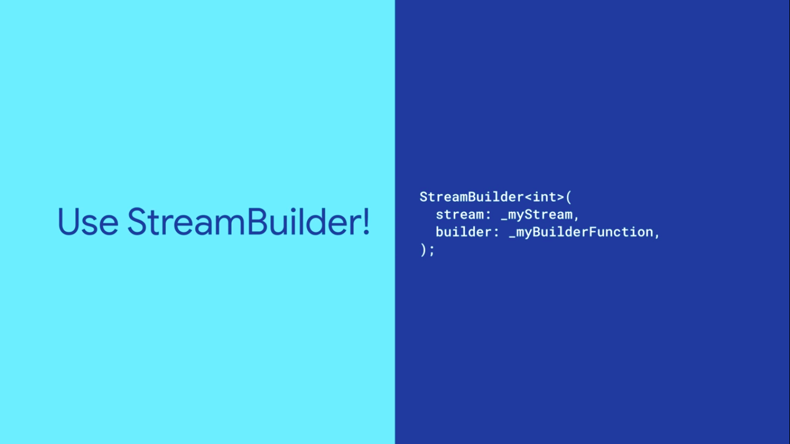
 </div>

Widget tree

<div align="center">
   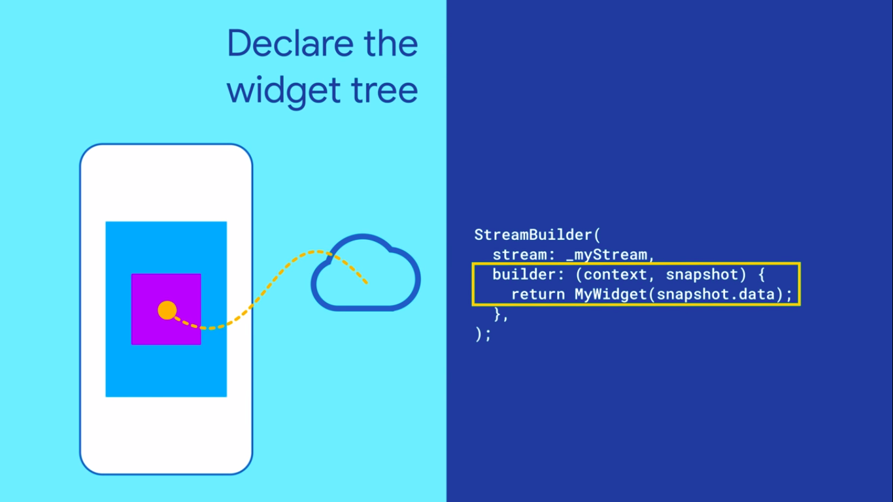
 </div>

 To avoid the delay in the first load we can use the initialData

 <div align="center">
   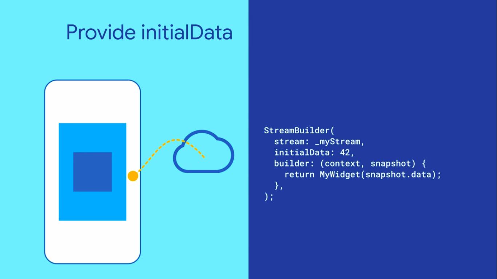
 </div>

 else we can show a loader based on the connection state as well it is better to handle the error state (important)

 <div align="center">
   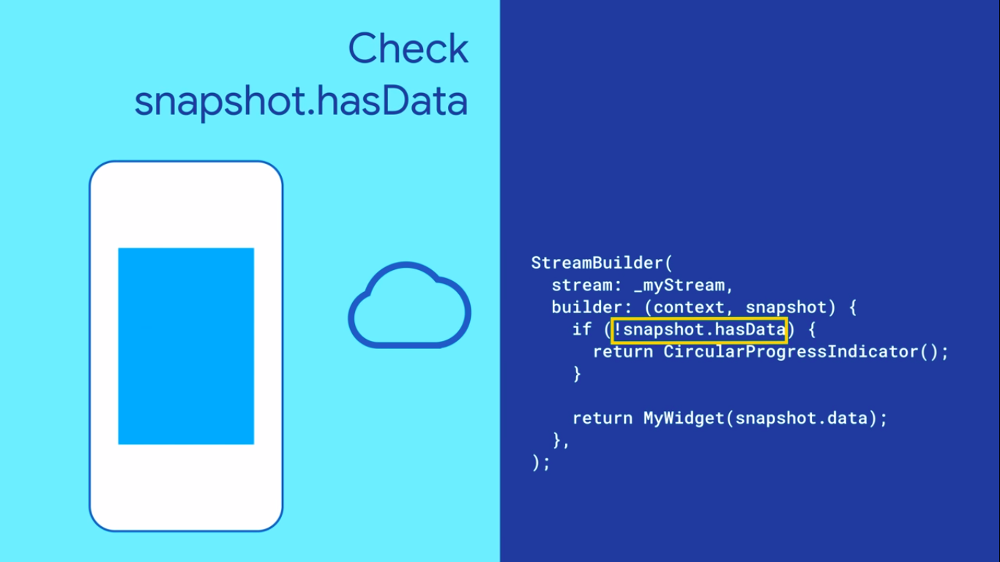
 </div>

StreamBuilder is used with Firebase, Internet connection check

# Inherited model

Inherited Model is similar like Inherited Widget where the parent is changed the childrens would be get updated.

Whenever the parent is updated the child can be updated based on the `updateShouldNotify` it is similar like `componentShouldUpdate` in React

# ClipRRect

ClipRRect widget is used to round the corners of the widget, The R denotes Rounded

```
ClipRRect(
    borderRadius: BorderRadius.circular(15.0),
    child: MyDashPicWidget(),
);
```

Similar like ClipRRect there are other widgets like ClipOval, ClipPath

# Hero

Hero widget is like a transition effect given to an image when the user clicks an image from the grid it will open an detail view for the image

To make the Hero widget add it in both the pages that is the page which it leaves onclick and the page which will be opened next like below

<div align="center">
   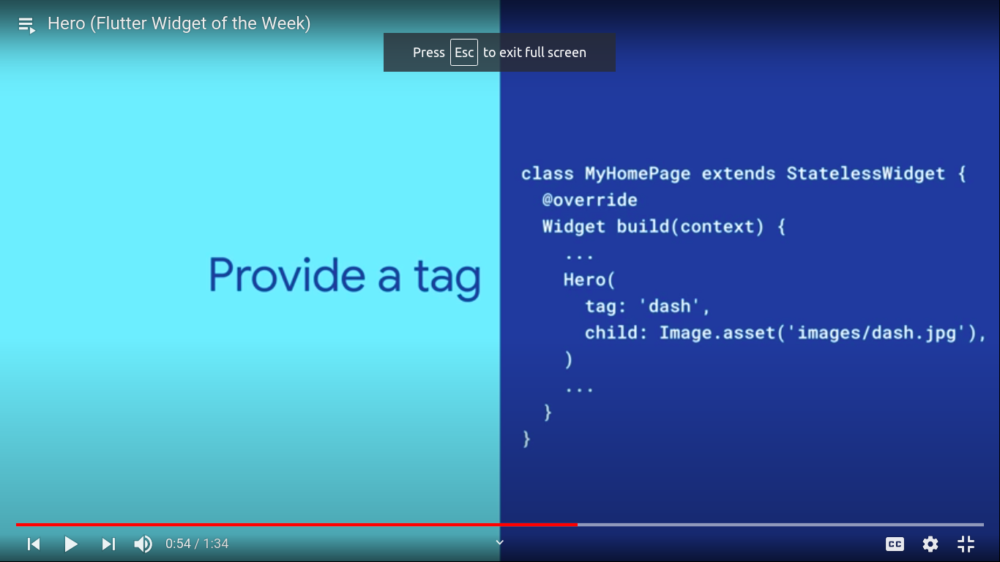
 </div>

 If u notice the above image there is an `tag` in the Hero widget. both the sender and receiver should have the same tag name (to make which transition it should call)

 # CustomPaint

 Create shapes and effects we would use the custompaint option and it is similar like the example which we have done in the React for the Odometer where we use the svg kind of stuff

 # Tooltip

 To show an message when the user click a icon / image we can provide the toolip option which would be useful for the  people who have impaired vision

 <div align="center">
   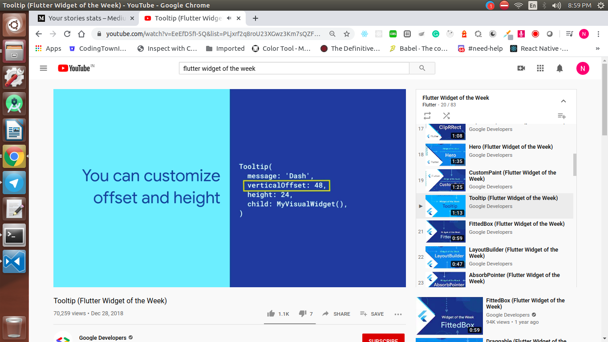
 </div>