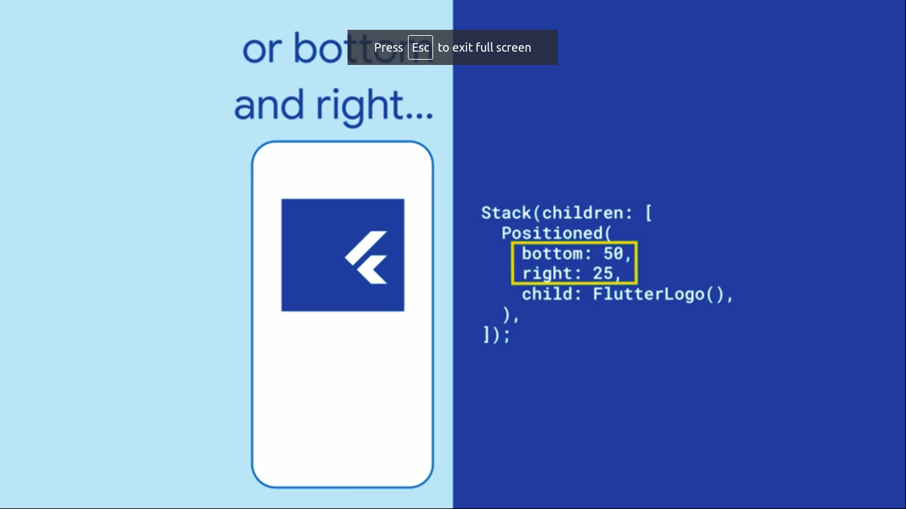

  <h1>Flutter - Day 23</h1>
  
Flutter Widgets

# FittedBox

Most of the widgets are boxes we can lay them of, stack them, nest them inside other widget

But what if the widget doesn't fit inside another widget then we will use the `FittedBox` widget

   

   

and a BoxFit to contain like below

   

Now the widget will be fitted inside the other widget like below

   

There are options like `Width`

   

`Fill`

   

`None` option

   

# Layout Builder

Layout Builder is like what should be shown in a screen like if it is a mobile view how the screen should be shown.Suppose if it is a tablet can be show a two screens in a single page

   

# Absorb pointer

Absorb pointer is like a disabling a button or disabling the scroll view but if you have a bunch of widgets inside a single page u can use the Absorb pointer like below

   

Absorbing false

   

# Transform Widget

Transform widget is like rotating an widget or to give an custom effet similar like the Ramotion kind of card view. It can be used for Cardview, Carousel, menu

# Backdrop Filter

Backdrop filter is to add filter for the images like blurring, skew

# Align

How to align a text inside a container to center align we can use the `Center` widget but what we do if we want it to align `BottomRight` and `TopLeft` how it can be done.

   

Or if we need it at the top left

   

and even we can give values based on the x and y axis 

   

# Positioned

In a stack if u want to position an widget you can use the positioned widget using that we can position the widget on left, top, right, bottom 

   

Even we can fill the widget in positioned like below

   

# AnimatedBuilder

To animate an widget we would use the animated builder widget where we can animate an widget

   

# Dismissable

Swiping an list item to delete item we can use the Dismissable widget

   

To add the dismissable widget in a stateful widget we can use the `onDismissed` widget like below

   

# SizedBox

SizeBox is like adding a perfect width and height for a button/widget. We can give the width and the height for the widget or else we can give the `double.infinity` where we can widget/button based on the size available
Suppose if we give `double.infinity` for both width and height means it fill the entire place instead we can give other option like `sizedBox.expand`

   

Expand

   

