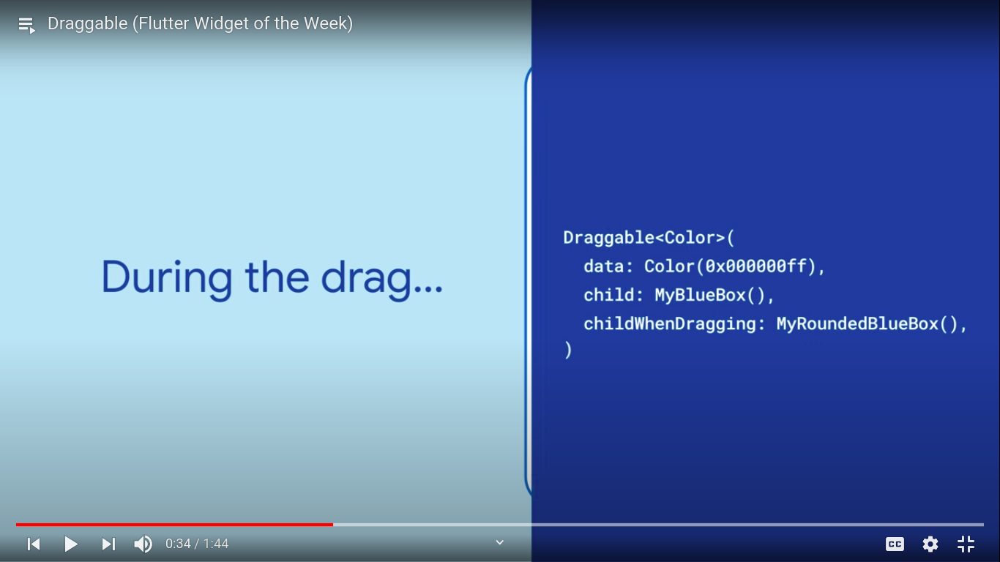

  <h1>Flutter - Day 24</h1>
  
Flutter Widgets

# ValueListenableBuilder

ValueListenableBuilder is like suppose if you want to update an value across the widgets it can be done using `ValueListenableBuilder`

# Draggable

Draggable widget is like dragging an widget from one location to another similar like material cdk.

To drag an object from source to target there are two things to be seen like below

   

   

# Animated List

AnimatedList is animating the list when a new item is added to the list nor an existing item removed from the list

It can be done using the `AnimatedList()` widget like below

   

   

inserting an item

   

list state

   

# Flexible

Flexible widget is used to add flex for the widgets

   

# MediaQuery

MediaQuery is similar like LayoutBuilder where we can see the `size` of the screen, `orientation` of the screen, `disableAnimation` etc.

# Spacer 

It is similar like adding space between two widgets like the sizedBox widget

   

# Inherited Widget

Inherited Widget is like passing the values from parent to the child using the InheritedWidget and it get the value over the using the `of` similar like getting primary color from Color page

and to check the old and new value we would use the `bool shouldNotify` and check the old and new value and update the widget

# Animated Icons

Flutter has some animated icons in it to make use of it look at the below code

   

# Aspect Ratio

AspectRatio widget is to set the width and height of the widget irrespective of the height and width of the screen

   

# LimitedBox

LimitedBox widget is to add height for the child widget.IF the parent widget has a width and height then there is no use of giving LimitedBox.IT would be useful when the parent doesn't have width / height like the listview where we can give the height for the list item

   

