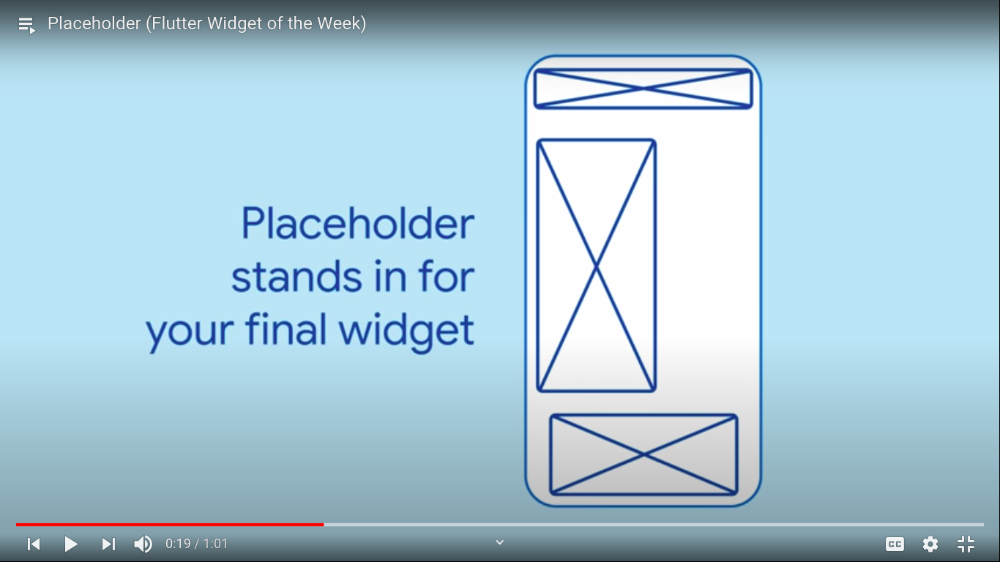
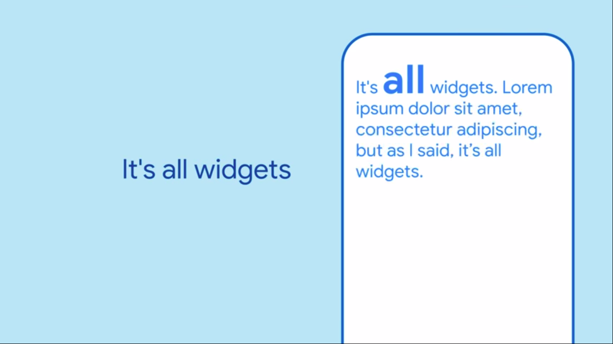
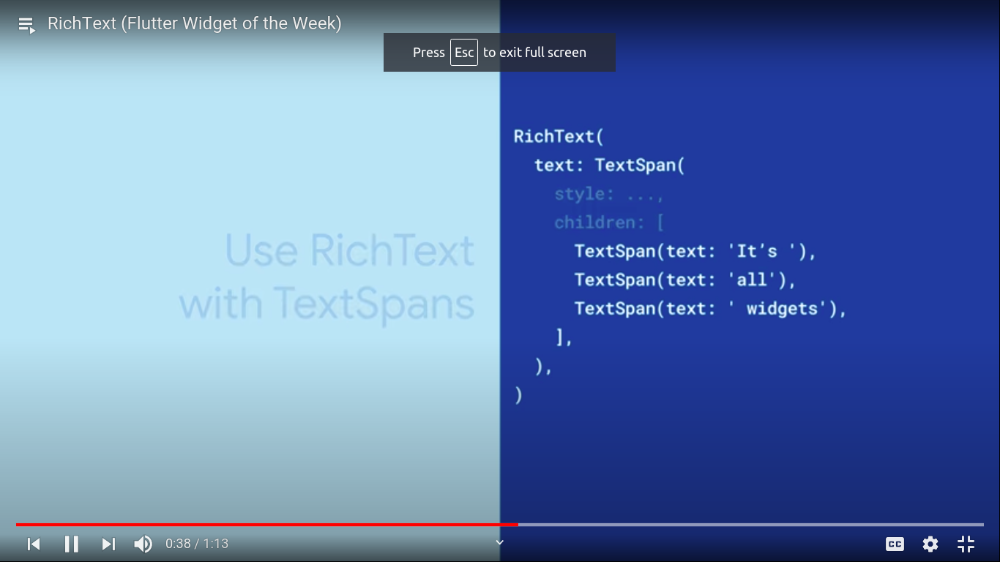
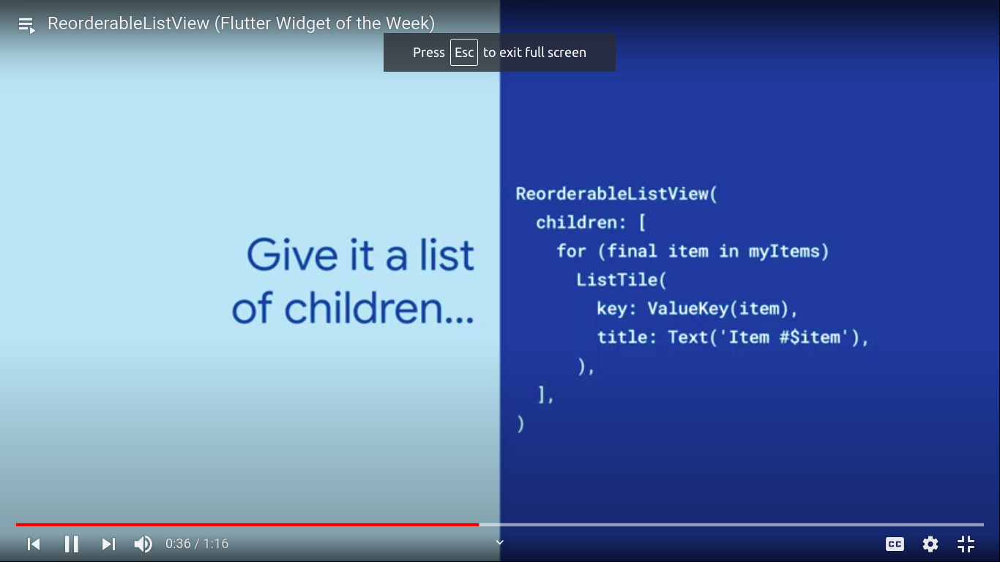
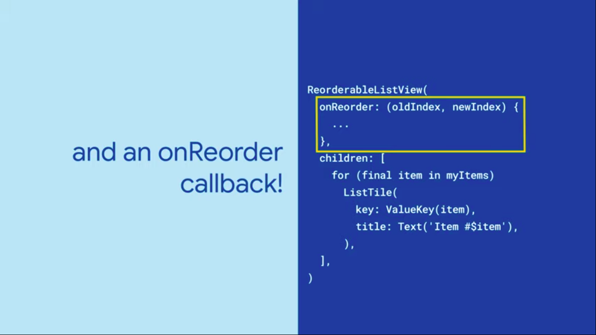
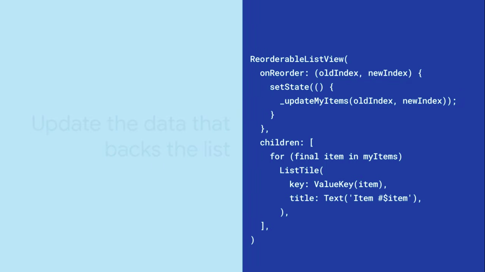
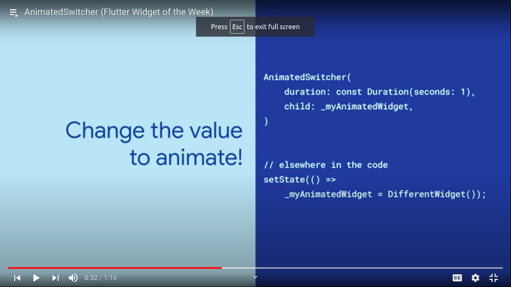
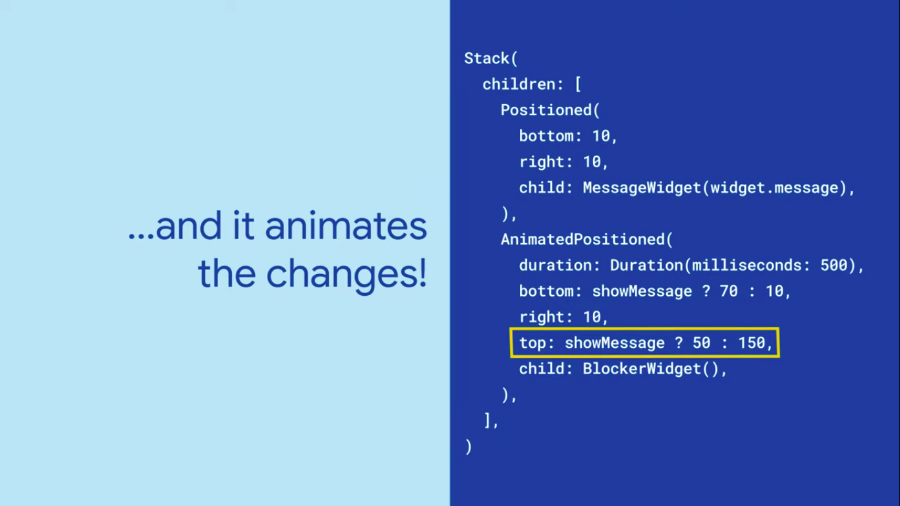

<div align="center">
  <h1>Flutter - Day 26</h1>
  <p>Flutter Widgets</p>
</div>

# Placeholder

Placeholder widget is used when you are going to do something on the page. To be clear for the initial prototype you would use the x for the image view and textview the same can be done is flutter using the `Placeholder` widget

```
Placeholder(
    fallbackHeight,
    fallbackWidth
)
```

We can define the height and width of the placeholder widget

<div align="center">
   
</div>

# Richtext

RichText widget is to have different styles for the text like the below image

<div align="center">
   
</div>

We can define the richtext widget like below

<div align="center">
   
</div>

# Reorderable List View

Reordering the list item in the list view can be done using Reorderable listview


<div align="center">
   
</div>

To set the reorder list we would do like below

<div align="center">
   
</div>

Update

<div align="center">
   
</div>

# AnimatedSwitcher

AnimatedSwitcher is to add animation between two widgets call that is setting the transistion effect between the two AnimatedSwitcher

First we will set which widget should be shown in the `AnimatedSwitcher` like below and to change the widget it can be done using setState

<div align="center">
   
</div>

# AnimatedPosition

AnimatedPosition is used to add animation for the widget we create like below

<div align="center">
   
</div>