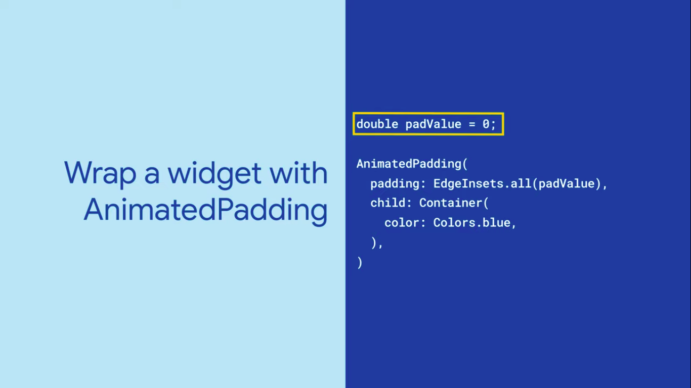
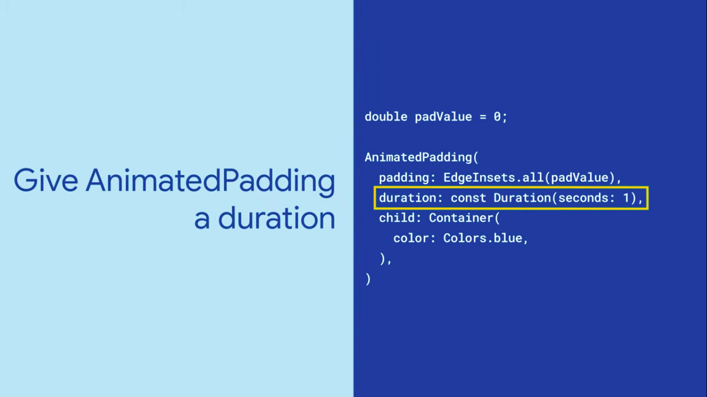
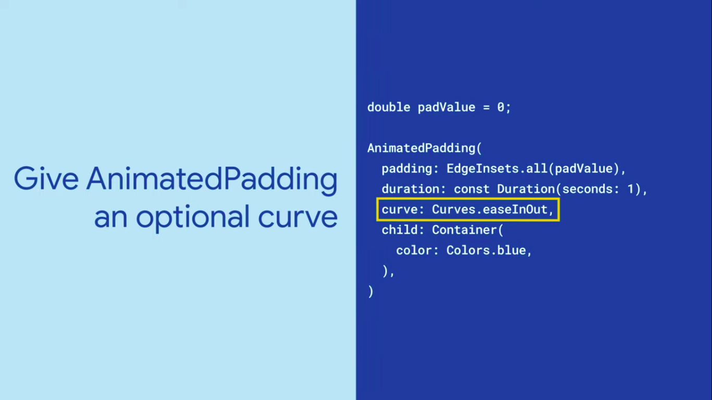
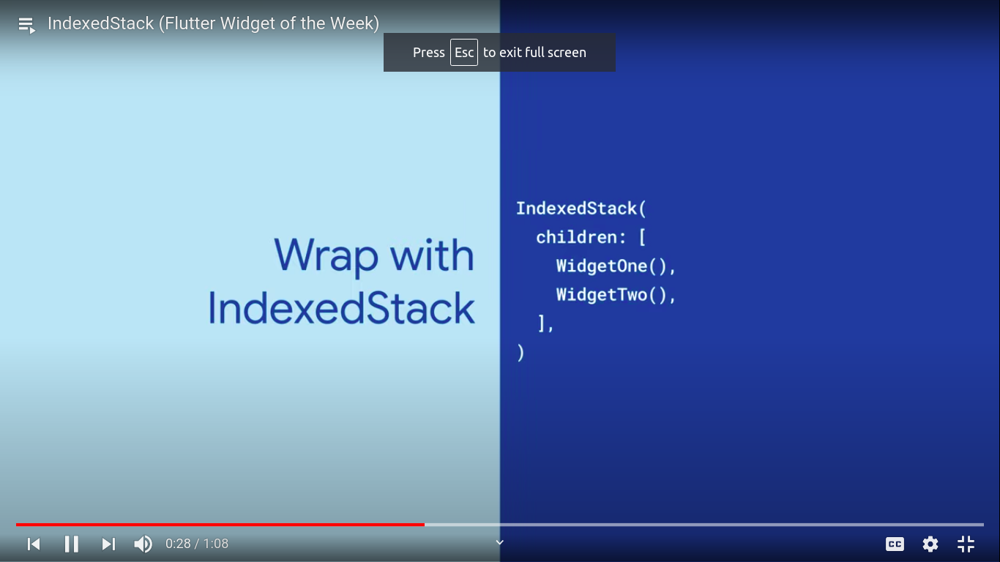
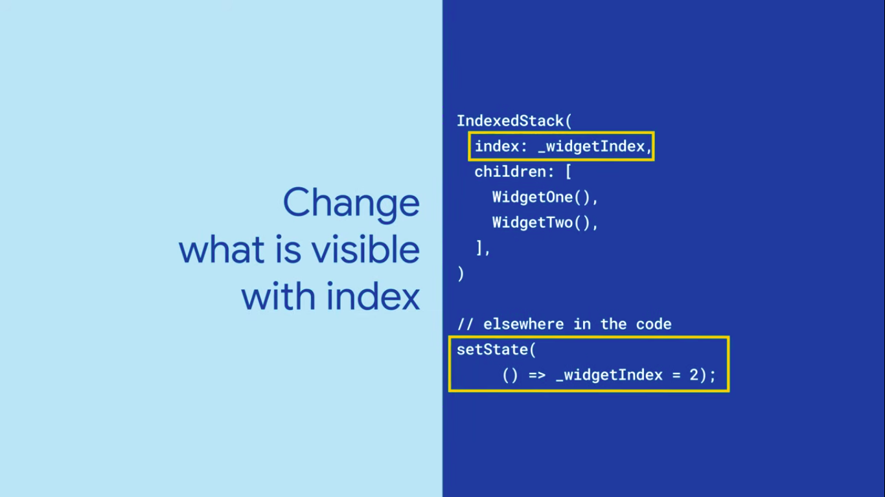

  <h1>Flutter - Day 27</h1>
  
Flutter Widgets

# Animated Padding

To make the padding animated we can use the AnimatedPaddingWidget through which we can show the animations on the padding whenever the padding value get changed.

To do that go do the below steps

   

Adding duration for the padding

   

Adding curve for the padding

   

We can handle the padding value inside the stateful widget now whenever the padding value gets changed the animation will takes place

# IndexedStack

IndexedStack widget is like the TV channel which will show only one widget at a time but in the background the rest of the widgets would be runnning to make an indexed stack do the below steps

   

To set the index do like below

   

