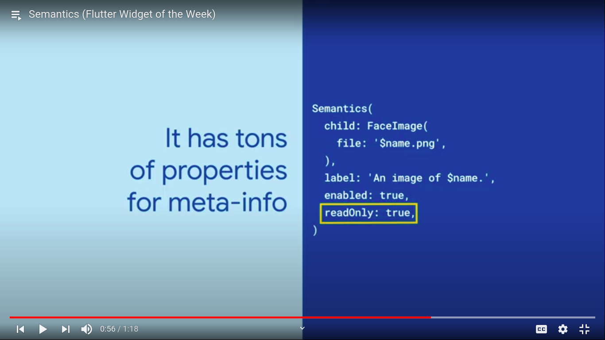
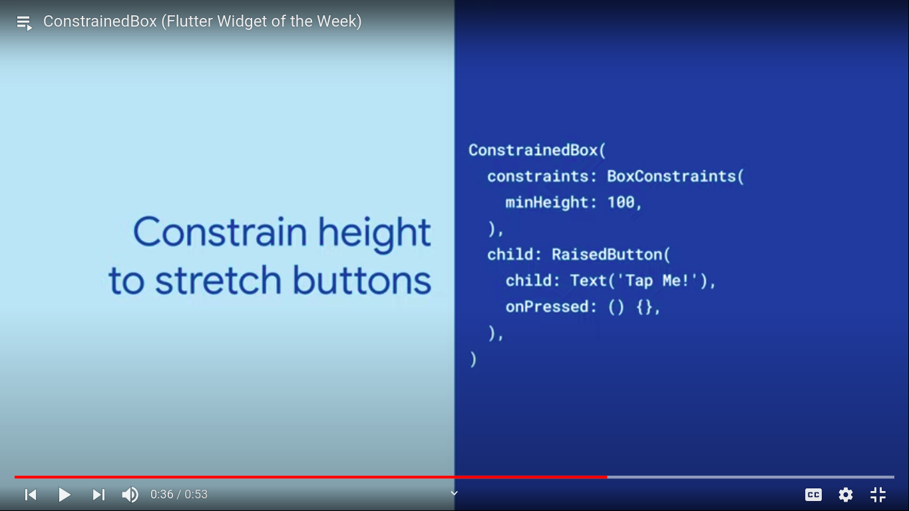
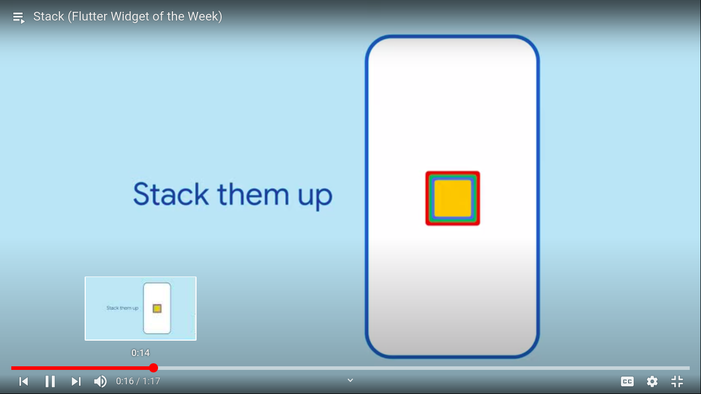
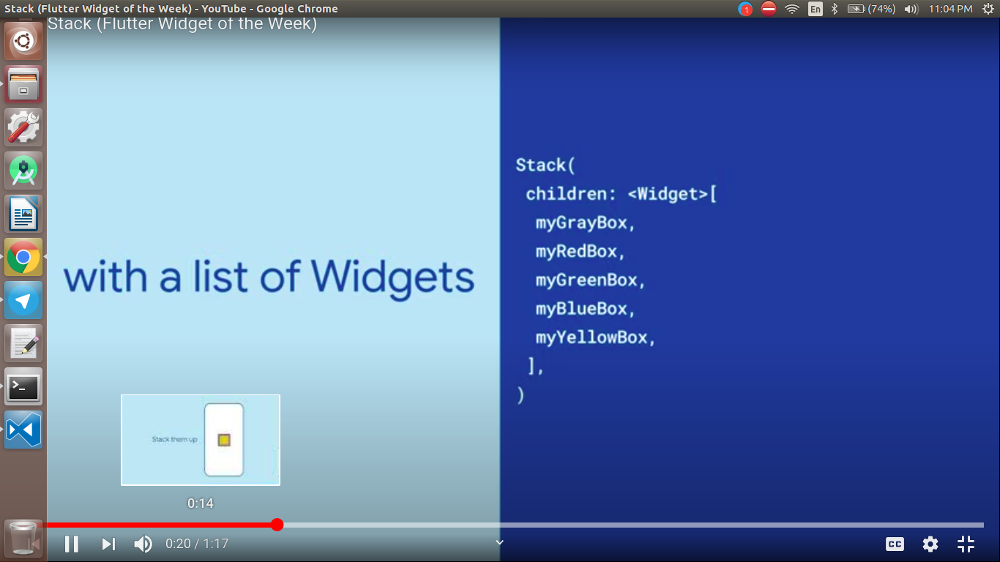
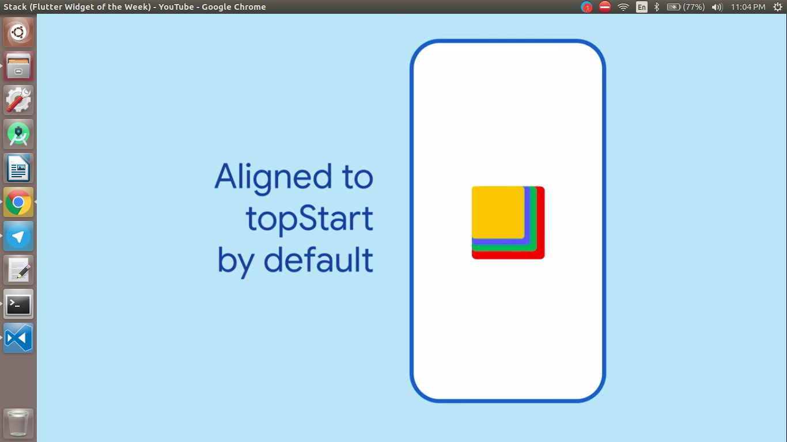

  <h1>Flutter - Day 28</h1>
  
Flutter Widgets

# Semantics

Flutter's Semantics widget can annotate an app's UI with information about the meaning of other widgets. It has almost fifty properties you can use to provide descriptions, metadata and more to screen readers and other semantic analysis-based tools.

   

# Constraint Box

Flutter's ConstrainedBox widget is great to add requirements for a widget's sizing behavior. Wrapping widgets in a ConstrainedBox lets you specify their min and max width and heights. 

   

# Stack

If you've ever wanted overlapping elements, then Stack is the widget for you! Stack allows you to overlay multiple widgets on top of each other. For example, you can use a Stack to add text over an image.

   

   

By default the stack would be positioned at top start like below

   

