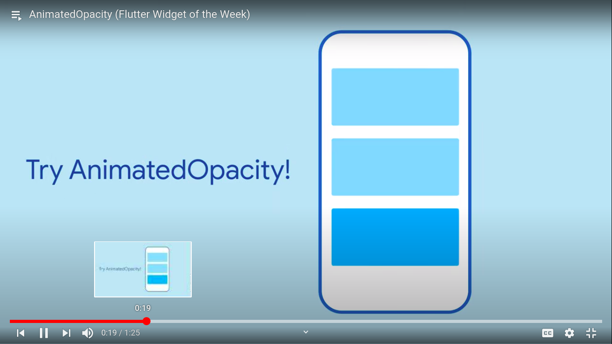
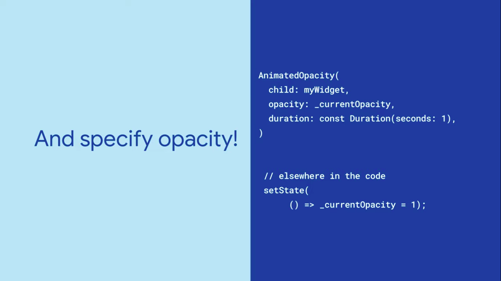

  <h1>Flutter - Day 29</h1>
  
Flutter Widgets

# Animated Opacity

Want to change how visible a widget is with a nice animation? AnimatedOpacity can help by fading a widget into view or by making it less prominent when something is not selected. 

If the opacity is 0 then it is not visible and if it is 1 means the widget is visible and we can given any number between 0 and 1

   

Adding opacity

   

