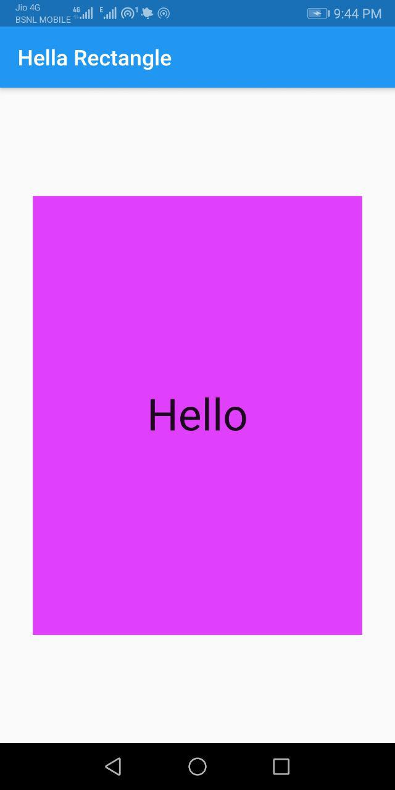

<div align="center">
  <h1>Flutter - Day 3</h1>
  <p>Flutter Rectangle Creation</p>
</div>

We will create a simple rectangle in Flutter

1. Clear all the files in main.dart file and add the below stuffs at first

```
void main() {
  runApp(
    MaterialApp(
      debugShowCheckedModeBanner: false, //if you don't want to see the debug option
      home: Scaffold(
        appBar: AppBar(
          title: Text('Hella Rectangle'),
        ), 
        body: HelloRectangle(),
      ), // it will have title and body
    ), // Instead of creating toolbar, we can use material theme
  ); //needed to see the output in mobile
}
```


In the above code you can see one thing like HelloRectangle() which is a seperate class where we will write all the logics for the container.
Because the containers will have a lot of codes so it is better to write it seperately

Now we will write the `HelloRectangle()` 

```
class HelloRectangle extends StatelessWidget {
  @override
   Widget build(BuildContext context) {
    return Center(
      child: Container(
        color: Colors.purpleAccent,
        height: 400.0,
        width: 300.0,
        child: Center(
          child: Text(
            'Hello',
            style: TextStyle(fontSize: 40.0,),
            textAlign: TextAlign.center,
          ),
        ), // text inside the rectangle aligning it to center and adding style
      ), // Container rectangle block
    ); //Centering the contents it is also an widget
  }  // need to know why it is used
} //Class is a stateless widget
```

Here is the output

<div align="center">
  
</div>