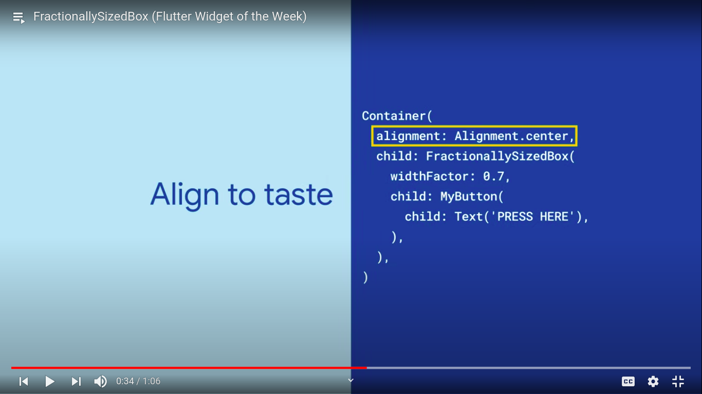

<div align="center">
  <h1>Flutter - Day 30</h1>
  <p>Flutter Widgets</p>
</div>

# Fractionally sized box

Sometimes your design calls for dimensions that are relative. FractionallySizedBox allows you to size the child to a fraction of the total available space. 


<div align="center">
   
</div>

In the above if u see the `widthFactor` which shows the percentage that is `0.7` equals `70%`

# List View

Want a set of items to be viewable in a scrollable list? ListView is as simple as supplying a list of items and can be easily customized to your liking. Try it out and start scrolling now!

```
ListView(children: [1,2,3]);
```

* To scroll horizontally use like below

```
ListView(children: [1,2,3], scrollDirection: Axis.horizontal);
```

* To scroll vertically use like below

```
ListView(children: [1,2,3], scrollDirection: Axis.vertical);
```

* List in reverse order

```
ListView(children: [1,2,3], reverse: true);
```

* List without scrollable

```
ListView(children: [1,2,3], physics: NeverScrollableScrollPhysics);
```

* Disable items keeping live 

```
ListView(children: [1,2,3], addAutomaticKeepAlives: false);
```
