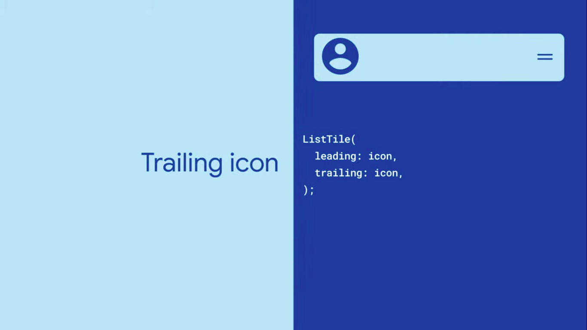
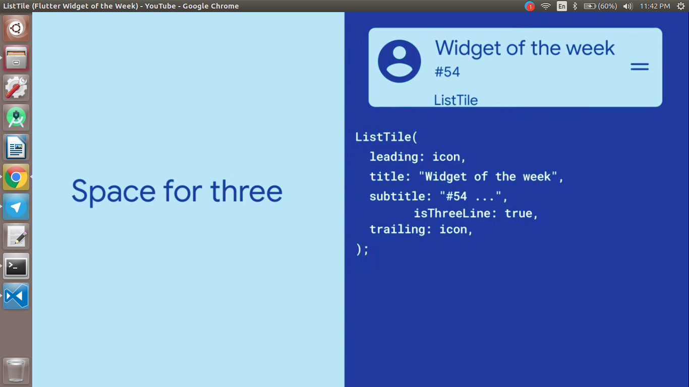

  <h1>Flutter - Day 31</h1>
  
Flutter Widgets

# List Tile

Why spend hours working out the perfect item layout with rows, columns, containers, and various amounts of spacing and styling when you could just use a ListTile! ListTile implements the material design pattern for list items for you, leaving you to just worry about what goes in it.

Using List Tile we can add the Leading and Trailing Icons

   

If we have text in between the icons we can do like below

   

