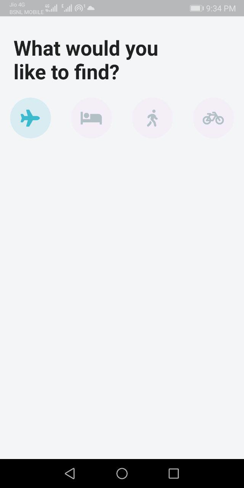

<div align="center">
  <h1>Flutter - Day 32</h1>
  <p>Flutter Travel UI</p>
</div>

We will create an Travel UI in which we will create a text and a buttons like the below screen

1. First we will create an Flutter project and then install the `font_awesome_flutter` plugin in `pubspec.yaml` file.
2. Once the plugin is installed add the images in assets/images folder and enable the assets folder
3. Once done open `main.dart` file and add the `colors`
4. create a new screen `home_screen.dart` file and create a `statefulWidget`
5. Open `lib/models` and create the files likes `activity_model.dart`, `destination_model.dart` and `hotels_model.dart` file and add the below codes

```
class Activity {
  String imageUrl;
  String name;
  String type;
  List<String> startTimes;
  int rating;
  int price;

  Activity({
    this.imageUrl,
    this.name,
    this.type,
    this.startTimes,
    this.rating,
    this.price
  });
}
```

```
import 'activity_model.dart';

class Destination {
  String imageUrl;
  String city;
  String country;
  String description;
  List<Activity> activities;

  Destination({
    this.imageUrl,
    this.city,
    this.country,
    this.description,
    this.activities,
  });
}

List<Activity> activities = [
  Activity(
    imageUrl: 'assets/images/stmarksbasilica.jpg',
    name: 'St. Mark\'s Basilica',
    type: 'Sightseeing Tour',
    startTimes: ['9:00 am', '11:00 am'],
    rating: 5,
    price: 30,
  ),
  Activity(
    imageUrl: 'assets/images/gondola.jpg',
    name: 'Walking Tour and Gonadola Ride',
    type: 'Sightseeing Tour',
    startTimes: ['11:00 pm', '1:00 pm'],
    rating: 4,
    price: 210,
  ),
  Activity(
    imageUrl: 'assets/images/murano.jpg',
    name: 'Murano and Burano Tour',
    type: 'Sightseeing Tour',
    startTimes: ['12:30 pm', '2:00 pm'],
    rating: 3,
    price: 125,
  ),
];

List<Destination> destinations = [
  Destination(
    imageUrl: 'assets/images/venice.jpg',
    city: 'Venice',
    country: 'Italy',
    description: 'Visit Venice for an amazing and unforgettable adventure.',
    activities: activities,
  ),
  Destination(
    imageUrl: 'assets/images/paris.jpg',
    city: 'Paris',
    country: 'France',
    description: 'Visit Paris for an amazing and unforgettable adventure.',
    activities: activities,
  ),
  Destination(
    imageUrl: 'assets/images/newdelhi.jpg',
    city: 'New Delhi',
    country: 'India',
    description: 'Visit New Delhi for an amazing and unforgettable adventure.',
    activities: activities,
  ),
  Destination(
    imageUrl: 'assets/images/saopaulo.jpg',
    city: 'Sao Paulo',
    country: 'Brazil',
    description: 'Visit Sao Paulo for an amazing and unforgettable adventure.',
    activities: activities,
  ),
  Destination(
    imageUrl: 'assets/images/newyork.jpg',
    city: 'New York City',
    country: 'United States',
    description: 'Visit New York for an amazing and unforgettable adventure.',
    activities: activities,
  ),
];
```

```
class Hotel {
  String imageUrl;
  String name;
  String address;
  int price;

  Hotel({
    this.imageUrl,
    this.name,
    this.address,
    this.price,
  });
}

final List<Hotel> hotels = [
  Hotel(
    imageUrl: 'assets/images/hotel0.jpg',
    name: 'Hotel 0',
    address: '404 Great St',
    price: 175,
  ),
  Hotel(
    imageUrl: 'assets/images/hotel1.jpg',
    name: 'Hotel 1',
    address: '404 Great St',
    price: 300,
  ),
  Hotel(
    imageUrl: 'assets/images/hotel2.jpg',
    name: 'Hotel 2',
    address: '404 Great St',
    price: 240,
  ),
];
```

Once the lib files are added go to the home screen and the text and button widgets like below code

```
import 'package:flutter/material.dart';
import 'package:font_awesome_flutter/font_awesome_flutter.dart';

class HomeScreen extends StatefulWidget {
  @override
  _HomeScreenState createState() => _HomeScreenState();
}

class _HomeScreenState extends State<HomeScreen> {
  int _selectedIndex = 0;

  List<IconData> _icons = [
    FontAwesomeIcons.plane,
    FontAwesomeIcons.bed,
    FontAwesomeIcons.walking,
    FontAwesomeIcons.bicycle,
  ];

  Widget _buildIcons(index) {
    return GestureDetector(
      onTap: () {
        setState(() {
          _selectedIndex = index;
        });
      },
      child: Container(
        height: 60.0,
        width: 60.0,
        decoration: BoxDecoration(
            color: _selectedIndex == index ? Theme.of(context).accentColor : Color(0xFFE7BEE),
            borderRadius: BorderRadius.circular(30.0)),
        child: Icon(
          _icons[index],
          size: 25.0,
          color: _selectedIndex == index ? Theme.of(context).primaryColor : Color(0xFFB4C1C4),
        ),
      ),
    );
  }

  @override
  Widget build(BuildContext context) {
    return Scaffold(
      body: SafeArea(
        child: ListView(
          padding: EdgeInsets.symmetric(
            vertical: 30.0,
          ),
          children: [
            Padding(
              padding: const EdgeInsets.only(left: 20.0, right: 120.0),
              child: Text(
                'What would you like to find?',
                style: TextStyle(fontWeight: FontWeight.bold, fontSize: 30.0),
              ),
            ),
            SizedBox(
              height: 20.0,
            ),
            Row(
              mainAxisAlignment: MainAxisAlignment.spaceAround,
              children: _icons
                  .asMap()
                  .entries
                  .map(
                    (MapEntry map) => _buildIcons(map.key),
                  )
                  .toList(),
            )
          ],
        ),
      ),
    );
  }
}
```

If you run the code you could see the output like below

<div align="center">
   
</div>