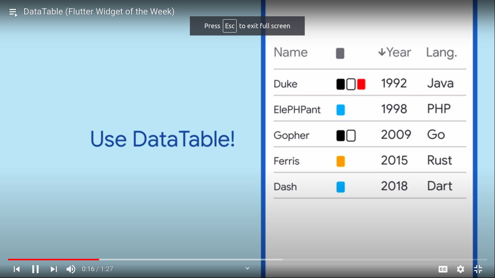

  <h1>Flutter - Day 34</h1>
  
Flutter widgets

# Selectable Text

If you app needs an Select copy option then you can use the `selectable text` using which we can copy or share the selected text.

To have the selected text we will be having the snippet like below

   

Suppose if we have text with scrollable option we can have the scrollable feature like below

   

# Data Table

To have a table in our Flutter application we can use the Data Table widget option through which we can show the data in a tabular format like below

   

The syntax for the data table is like below

   

We can have the sort option for the table even we can add the widgets inside each cell as well add icons for each cell