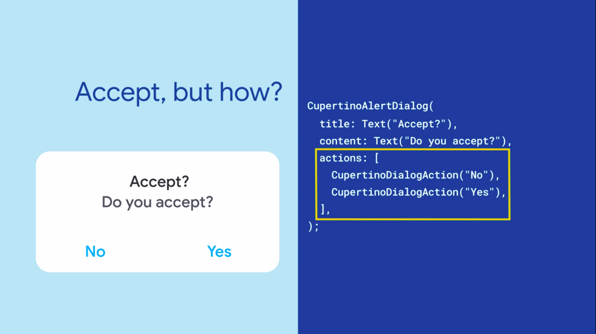

  <h1>Flutter - Day 35</h1>
  
Flutter widgets

# Slider

To have a slider in flutter we can have the Slider widget using the Slider widget we can have the slider in the application

To have the slider in your application use the below code

   

If we want divisions in the slider we can have the division option in it

Suppose in the slider if we need the label we can do it like below

   

# AlertDialog

If we need to some special information to the user we can do it using the `AlertDialog` we can have the alertDialog like below

   

AlertDialog with buttons

   

For Material Alert we can do like below

   

If we need to add a shape for it we can do like 

   

